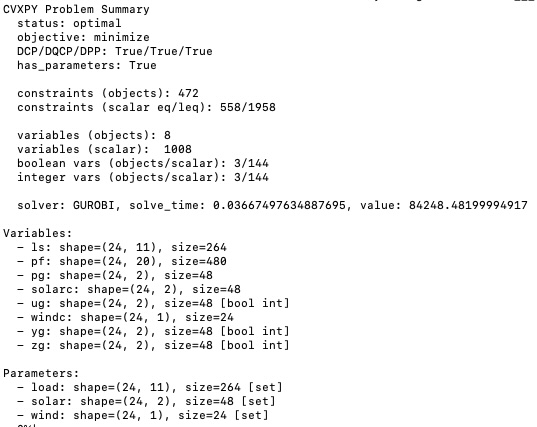

# CVXPY Summary

**cvxpy_summary** is a lightweight utility package for inspecting and debugging [CVXPY](https://www.cvxpy.org/) optimization models. It provides a compact summary of a `cvxpy.Problem`, including DCP/DQCP/DPP status, constraint and variable counts (with scalar breakdown), parameter presence, and solver statistics. Optional detailed listings report each variable/parameter’s name, shape, size, and integrality (boolean/integer) flags to quickly diagnose modeling and scalability issues.

An example output is shown below when I am solving a [unit commitment](https://en.wikipedia.org/wiki/Unit_commitment) problem with CVXPY.

<p align="center">
  
</p>

## Install

From PyPI:
```bash
pip install cvxpy-summary
```

Editable from a local checkout:
```bash
pip install -e .
```

Or pin to a GitHub tag/commit:
```bash
pip install "git+https://github.com/xuwkk/cvxpy_summary.git@v0.1.2"
# or @<commit-sha>
```

## Usage

```python
import cvxpy as cp
from cvxpy_summary import print_summary

x = cp.Variable(3)
prob = cp.Problem(cp.Minimize(cp.sum_squares(x)), [x >= 0])
print_summary(prob, include_entity_details=True)
```

The attributes of the `print_summary` function are:

- `prob`: The CVXPY problem to summarize.
- `include_entity_details`: If True, include detailed listings of variables and parameters.
- `sort_entities_by`: The sorting order for the detailed listings.
- `max_entities`: The maximum number of entities to include in the detailed listings.
